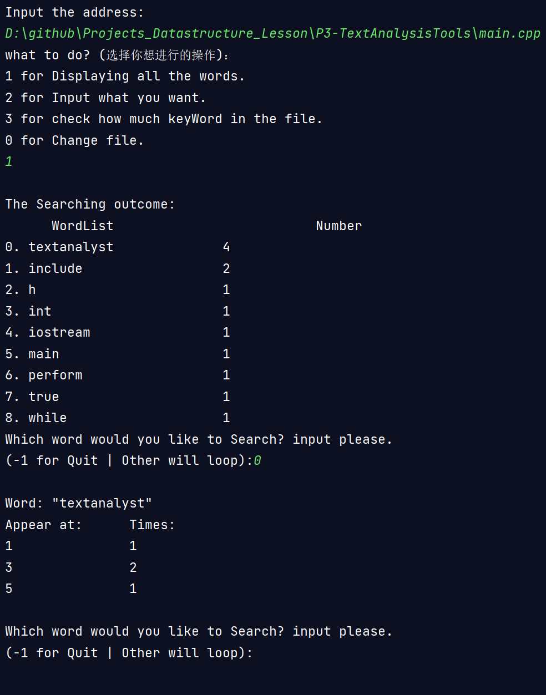

# P3 文本分析工具-实验报告
## 目录
- [P3 文本分析工具-实验报告](#p3-文本分析工具-实验报告)
  - [目录](#目录)
  - [程序功能简要说明](#程序功能简要说明)
      - [值得注意的细节：](#值得注意的细节)
  - [程序运行截图展示](#程序运行截图展示)
  - [程序运行方式简要说明。](#程序运行方式简要说明)
      - [程序执行逻辑](#程序执行逻辑)
  - [部分关键代码及其说明。](#部分关键代码及其说明)

## 程序功能简要说明

本程序通过clion开发。

本程序通过文件路径读取文本文件。

本程序能在一次处理文本后，提供对文本信息的简单分析功能：

0. 重新加载新的文本文件。
1. 显示所有出现在文本的单词。
2. 手动输入想要查询的单词或单词片段。显示搜索到的所有可能结果。
3. 显示所有找到的C++保留关键字。

#### 值得注意的细节：

1. 功能1~3在显示结果时，将同时打印单词与单词出现次数，并按单词出现次数降序打印。
2. 不仅如此，打印出的每个单词前都会附带一个序号（0~n），向程序中输入序号将给出对应单词的更多信息，其中包括具体出现在了哪一行以及在该行的出现次数。
3. 本程序可以识别源代码文件。
4. 本程序排除了一些易错细节，如英语所有格"'s"。以及将一些由下划线连接的或数字连接起来的变量名视为一个整体，如图。

5. 本程序对所有输入都进行了鲁棒性优化，如图。

6. 更多细节请移步我的头文件[TextAnalyzer.h](TextAnalyzer.h)下方的日志（日志写的不是很好，但也算开始培养习惯）

## 程序运行截图展示

**功能1 显示所有单词**

**功能2 手动搜索单词**

**功能3 显示所有C++保留关键字**

**功能0 加载新的文档（这次是.cpp）**

**加载大文件时对单个单词的展示效果**

**加载普通的英文文本**

## 程序运行方式简要说明。
**头文件**

**main函数**

#### 程序执行逻辑
1. *perform*函数首先调用*initContainer*函数。然后向用户请求指令，也就是功能0~3.
2. 在*perform*输入0自然就会结束*perform*。回到*main*函数的*while*循环体，执行新的一次*perform*。
3. *initContainer*的任务有：
   1. 清空4个单词容器
   2. 输入需要分析的文本地址
   3. 分析文本，将单词填入两个词库容器。（其中使用了*trimLine2Word*成员函数）
   4. 排序两个功能用容器
4. 功能1~3都会调用*ShowAllWord_byVECTOR*成员函数。区别在于： 
   1. 功能1打印所有单词，直接向该函数输入容器"用于功能1"即可。
   2. 功能2查
